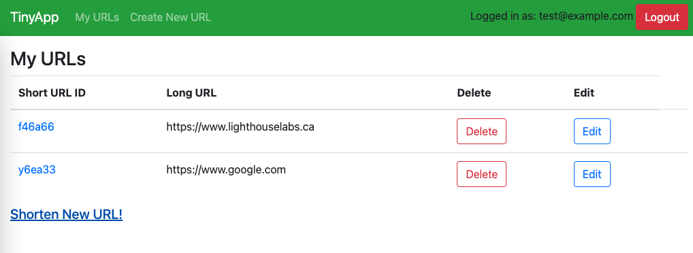
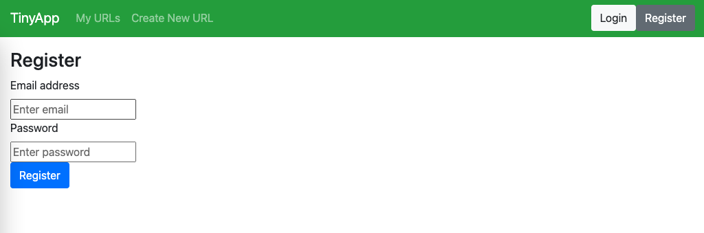
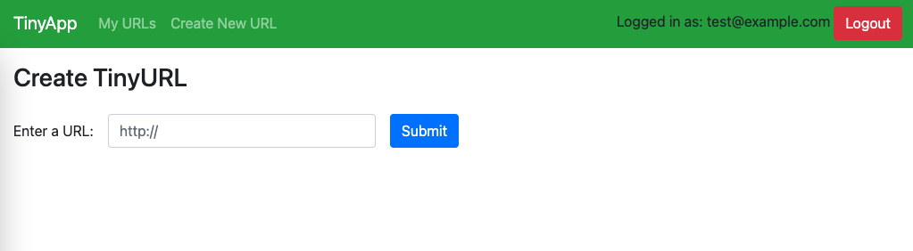
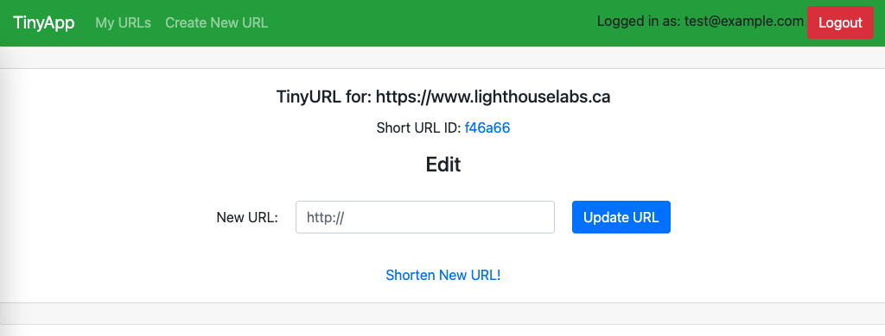

# TinyApp

TinyApp is a full stack web application built with Node and Express that allows users to shorten long URLs.

## Final Product

URLs page of logged in user

Registration page

Shorten new URL

Managing shortened URL

## Dependencies

- Node.js
- Express
- EJS
- bcryptjs
- body-parser
- cookie-session
- method-override

## Getting Started

1) Install all dependencies (using the `npm install` command).
2) Run the development web server using the `node express_server.js` command.
3) Go to `localhost:8080` on your browser.
4) Register as new user.
5) Create your own personal library of short URLs.
